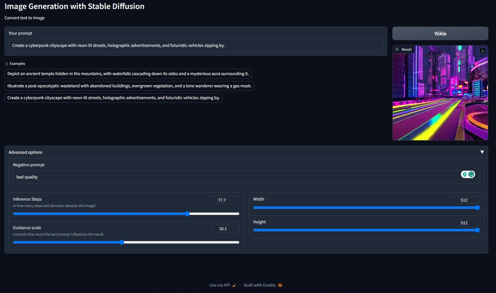

# Building Generative AI Applications with Gradio on Colab

## Overview

Welcome to the repository for my journey through the exciting short course, **Building Generative AI Applications with Gradio**, presented by deeplearning.AI and Hugging Face. This course has been an exhilarating exploration into the world of generative AI models and their applications. 🚀

## Course Highlights

🌟 **Interacting with Generative AI Models:** Dive into the power of Hugging Face's generative AI models. Create captivating applications that summarize text, describe images, and even generate images using diffusion models.

🌟 **Demo Applications:** Explore the interactive demo applications that showcase the potential of generative AI. Please note that these applications are not directly runnable in this repository.

🌟 **Notebooks for Google Colab:** I've prepared detailed notebooks for each lesson, which you can directly use and run on Google Colab to follow along with the course material.

## What's Inside

This repository contains:

📝 **Notebooks:** Detailed notebooks for each application, guiding you through the process of building generative AI applications. These notebooks are optimized for Google Colab.

## Getting Started

To explore the world of generative AI and gain insights into the applications I've built, follow these steps:

1. Clone or download this repository to your local machine.
2. Open the notebooks directory and access the notebooks for each application. You can run these notebooks directly on Google Colab.
3. You should have Hugging Face user tokens, and access Hugging Face Inference Endpoints.

## Acknowledgments

I would like to express my gratitude to deeplearning.AI and Hugging Face for offering this incredible learning opportunity. The course has been a transformative experience, and I'm excited to continue exploring the world of generative AI.

## License

This project is licensed under the MIT License - see the [LICENSE](LICENSE) file for details.

---

